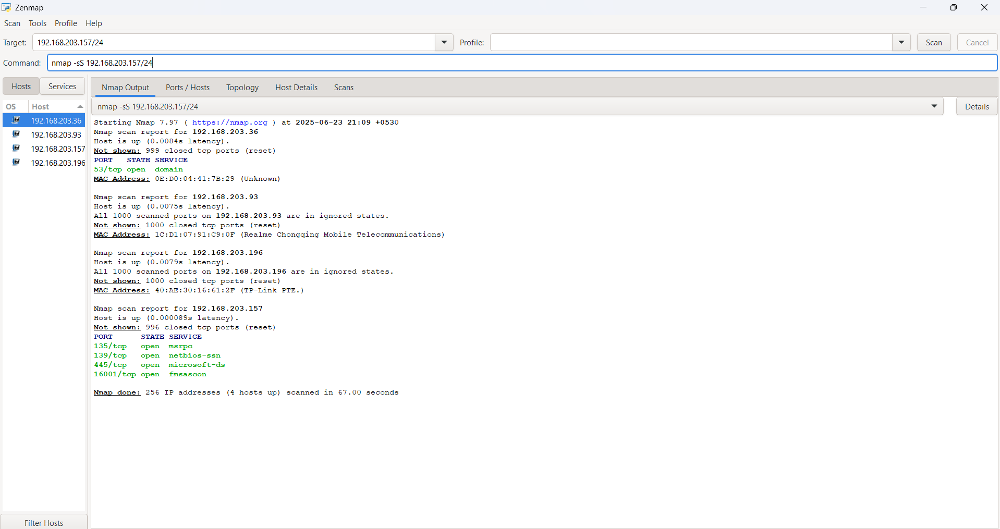
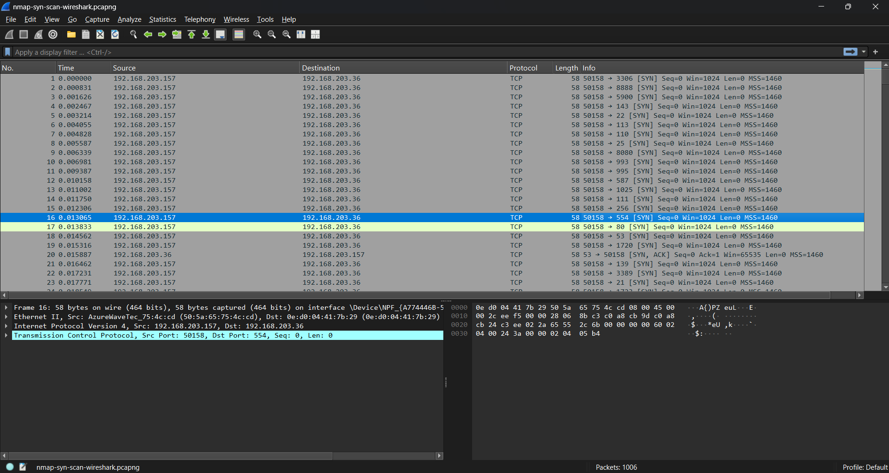

# 🚨 Elevate Cybersecurity Internship - Task 1

## 🔍 Task Title: Local Network Port Scanning and Analysis

This task involved performing various types of Nmap scans to detect open ports on devices in my local network, followed by traffic capture using Wireshark. The goal was to understand network exposure and potential security risks.

---

## 🎯 Objective

- Perform a TCP SYN scan to detect open ports.
- Identify the services running on discovered ports.
- Detect operating systems of connected hosts.
- Capture live scan traffic using Wireshark.
- Analyze and document risks related to exposed ports.

---

## 🛠 Tools Used

| Tool      | Purpose                             |
|-----------|-------------------------------------|
| Nmap      | Port scanning & service detection   |
| Zenmap    | GUI wrapper for Nmap                |
| Wireshark | Packet sniffing & traffic analysis  |

---

## 🧪 Scans Performed

### 1️⃣ Simple Nmap Scan (`1_simple-scan.txt`)
- **Target:** My Windows machine (`192.168.203.157`)
- **Ports Open:**
  - `135/tcp` → Microsoft RPC
  - `139/tcp` → NetBIOS Session
  - `445/tcp` → SMB (Windows Sharing)
  - `16001/tcp` → Unknown (custom/local service?)

---

### 2️⃣ TCP SYN Scan (`basic-syn-scan.txt`)
- **Target Subnet:** `192.168.203.0/24`
- **Hosts Found:** `192.168.203.157`, `192.168.203.36`, `192.168.203.93`
- **Open Ports on Mobile (`.36`):**
  - `53/tcp` → `domain` (DNS)

---

### 3️⃣ OS Detection (`os-detection.txt`)
- **Results:**
  - `.36`: Android or Linux (high accuracy)
  - `.93`: Realme device (Mobile Telecom), OS fuzzy
  - `.157`: Windows OS (my PC)

---

### 4️⃣ Service Version Detection (`version-detection.txt`)
- **Services Identified:**
  - `.36`: `dnsmasq 2.51`
  - `.157`: Microsoft RPC, NetBIOS, SMB

---

## 📡 Wireshark Packet Capture

- **File:** `nmap-syn-scan-wireshark.pcapng`
- **Filtered:** TCP SYN packets sent during scan
- **How:** Applied filter `tcp.flags.syn == 1` and exported relevant traffic.




---

## ⚠️ Security Risks Identified

| IP Address       | Open Port | Service         | Risk Summary                                      |
|------------------|-----------|------------------|--------------------------------------------------|
| 192.168.203.36   | 53/tcp    | dnsmasq 2.51     | Outdated DNS software; vulnerable to DNS cache poisoning if unpatched. |
| 192.168.203.157  | 445/tcp   | SMB              | Often targeted by malware like WannaCry.         |
|                  | 139/tcp   | NetBIOS-SSN      | Can allow enumeration or MITM if unfiltered.     |
|                  | 16001/tcp | Unknown          | Unknown service, possibly custom. Should be reviewed. |

> 🔐 **Suggestion:** Devices should disable unused services and apply firewall rules to limit exposure on untrusted networks.

---

## 📘 What I Learned

- How to discover open ports and services in a network.
- Real-world use of `-sS`, `-sV`, and `-O` options in Nmap.
- Packet analysis using Wireshark (especially TCP SYN/SYN-ACK).
- Identifying risks by correlating ports/services with vulnerabilities.
- How attackers use scans to fingerprint devices before an attack.

---

## 📁 Repository Structure

```plaintext
.
├── 1_simple-scan.txt
├── basic-syn-scan.txt
├── version-detection.txt
├── os-detection.txt
├── nmap-syn-scan-wireshark.pcapng
├── Nmap-Screenshot.png
├── Wireshark-Screenshot.png
└── README.md
